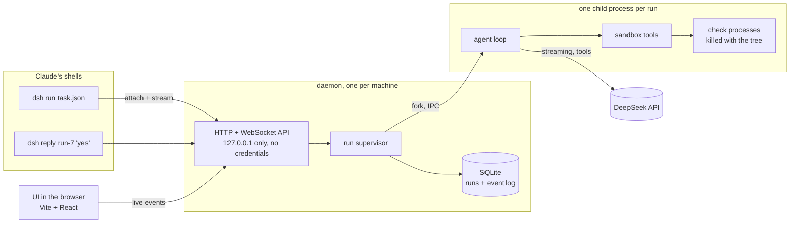

# Emil's DeepSeek Harness: the plan

This is the build plan for turning the Python prototype (`dsx.py`) into a proper tool: a daemon that runs sandboxed DeepSeek agents, a CLI that drives it, and a UI to watch them. It's written for the agent that builds it. Read all of it before writing code, and treat the acceptance checks as the definition of done, not the prose.

## What it has to do

1. A **task is a JSON file**: which worktree, which model, which files it may change, which checks it may run, what to do, and its limits.
2. `dsh run task.json` asks a **long-running daemon** to start an agent for that task.
3. The command **stays running until the agent finishes**, streaming what it does. **Killing the command kills the agent**, including anything it spawned.
4. **Two-way communication**: whoever launched it (usually Claude, from its shell) can send the agent a message mid-run, and the agent can ask a question and wait for an answer.
5. A **UI** for Emil: every agent, its JSON settings, and a live chat view of what it's doing.
6. **Passive speed metrics** on every model call: time to first token, generation speed, end-to-end speed, cache hits. No separate benchmark.
7. The **sandbox rules from `dsx.py` carry over exactly**. They're the whole point.

Not goals: multi-user, remote access, any kind of shell for the agent, running tests inside the sandbox, other model providers in v1 (keep a provider interface so it's possible later).

## The sandbox is the product

Everything else is plumbing. Port these rules from `dsx.py` one for one, and port `tests/test_sandbox.py` with them before anything else gets built.

- **Reads** only inside the worktree. Refuse `.git`, `target`, `node_modules`, `_private`, `dist`, and names matching `.env`, `.env.*`, `*.pem`, `*.pfx`, `*.p12`, `*.key`, `api_key`, `*secret*`, `*credential*`.
- **Containment is checked on the real path.** Resolve with `fs.realpath` before comparing, so a symlink or a Windows junction can't point outside. Compare case-insensitively on Windows (`F:\vsCode` and `f:\vscode` are the same folder).
- **Path normalisation strips only a literal `./` prefix.** The prototype first used `lstrip("./")`, which ate the leading dot of `.git` and `.env` so both walked past the deny lists. The ported test suite has a control that reinstates that bug and must go red.
- **Writes** only to the task's `allow` list, by exact-match replace (the old text must occur exactly once) or by creating an allowed file that doesn't exist yet. Refuse, even when allowed: `build.rs`, `*/build.rs`, `Cargo.toml`, `*/Cargo.toml`, `Cargo.lock`, `package.json`, `package-lock.json`, `pnpm-lock.yaml`, `yarn.lock`, `*.config.*`, `tsconfig*.json`, `.github/*`, `.claude/*`, `.cargo/*`, `rust-toolchain*`, `*.ps1`, `*.cmd`, `*.bat`, `*.sh`, `setup.py`, `pyproject.toml`, `Makefile`, `Dockerfile`.
- **No shell.** Checks run by name from a **profile**. The model picks a name, never an argument. `{allowed}` in a profile command expands to the allowed files matching the entry's `when` extensions. A `format` check applies the profile's formatters to the allowed files.
- **Profiles hold static checks only.** Typecheck, lint, formatter. Nothing that executes code the model wrote. Tests are run by the reviewer afterwards.
- **The profile and the harness live outside the worktree.** Refuse to start otherwise, or the model could edit its own rules.
- **Check processes get a stripped environment**: drop anything matching `DEEPSEEK|ANTHROPIC|CLAUDE|TOKEN|SECRET|PASSWORD|API_KEY|_KEY$`.
- **The worktree must be a git worktree.** At the end, `git status` is compared with the allow list and any stray change is reported loudly.
- **Output caps**: file reads page at 1,500 lines, check output truncates to 8,000 characters keeping head and tail, search stops at 80 hits and prunes the refused directories while walking.

The prototype's lessons are part of the spec too. The model once spent 17 turns guessing why `prettier --check` failed and then reverted its own correct edits, which is why `format` exists and the system prompt says to stop and report rather than undo good work. It once re-read its finished work instead of calling `finish`, which is why the prompt says to finish as soon as checks pass. Keep the system prompt from `dsx.py` as the starting point.

## Architecture



**Why a child process per run.** A crash in one agent can't take the daemon down, and cancelling is a clean process-tree kill rather than hoping a promise chain unwinds. The daemon talks to it over Node IPC.

**Why the event log.** Every run is an append-only list of events (status changes, streamed text, tool calls and results, questions, answers, messages, metrics). The chat view, the CLI stream, `dsh logs` and a resume after a restart are all just readers of that one list. Nothing keeps a second copy of the truth.

## Monorepo layout

npm workspaces, TypeScript strict, Node 22 or later, ESM throughout.

```
packages/
  core/     sandbox, profile + task schemas, event types, DeepSeek client, metrics
  worker/   the agent loop, run as a child process
  daemon/   HTTP + WebSocket server, supervisor, SQLite, serves the built UI
  cli/      the `dsh` command
  ui/       Vite + React front end
profiles/   esap.json and friends (a worked example, not part of the build)
legacy/     dsx.py and test_sandbox.py, kept until the port passes their tests
```

Suggested libraries, swap if there's a good reason and write the reason down: `zod` for schemas (reject unknown keys), `better-sqlite3` for storage, `ws` for WebSockets, `fastify` or plain `node:http` for HTTP, the `openai` SDK pointed at `https://api.deepseek.com` for streaming chat completions with tools (DeepSeek's API is OpenAI-compatible and supports tool calls; this has been checked), `vitest` for tests, `commander` for the CLI, and for the UI React, `@tanstack/react-query` for data, and something small for JSON viewing. Package names branded, for example `@emilswork/harness-core`; the command is `dsh`.

## The task file

```json
{
  "name": "mark-timeouts",
  "worktree": "F:/vsCode/esap-ds-1",
  "profile": "F:/vsCode/DeepSeekMinimalHarness/profiles/esap.json",
  "model": "deepseek-flash",
  "allow": ["ui/mark.spec.ts"],
  "checks": ["typecheck", "prettier"],
  "task": "Give mark.spec.ts's three polls a timeout of their own...",
  "limits": { "turns": 12, "wallSeconds": 900, "outputTokens": 40000 }
}
```

`task` can instead be `taskFile`, relative to the JSON file. `checks` optionally narrows the profile. Validate strictly and print every error at once, with the path of the bad field. The resolved config is stored with the run exactly as used, because that's what the UI shows and a run must never change its own rules halfway.

The key is **not** in the task file. The daemon reads it from `~/.deepseek/api_key` and it never appears in an event, a log line, an API response or the UI.

## The daemon

**Read this section alongside `docs/status.md`.** Two things it asks for were built,
used, and then removed: the token, and the random port. What replaced them and the
reasoning are in `status.md` under "Three things the plan asked for that are now gone
on purpose"; the text below is kept as written, with the two places it is no longer
true marked inline.

- Binds **127.0.0.1 only**, on a **fixed** port (`41777`, or whatever `config.json` names). Writes `{port, pid, startedAt}` to `%LOCALAPPDATA%/EmilsDeepSeekHarness/daemon.json`, readable by the user only. No token: see the next line for what replaced it.
- **Any local program may drive it; only a web page may not.** Three request headers decide that: `Host` must be this daemon (which is what stops DNS rebinding), an `Origin` if present must be the UI's own, and `Sec-Fetch-Site` if present must not be `cross-site`. A localhost server is reachable from any page the browser has open, so without these a random website could drive agents — and a *secret* cannot fix that, because it has to be handed out on the same machine to callers that can read it. There is no token, no cookie and no login. The port is fixed so the URL is worth bookmarking.
- Started automatically by the first CLI call if it isn't running. `dsh daemon stop|status`.
- On startup, any run left `running` by a crash becomes `interrupted`.

API sketch (the building agent can refine it, but keep it small and write it down in `docs/api.md`):

- `POST /runs` with a task, returns the run id
- `GET /runs`, `GET /runs/:id` (config, status, metrics), `GET /runs/:id/events?after=n`
- `WS /runs/:id/attach` streams events; the connection **owns** the run unless the run was started detached
- `WS /runs/:id/watch` is the same stream **without** owning it, so a second terminal can follow a run it cannot end
- `POST /runs/:id/messages` (tell the agent something), `POST /runs/:id/answers` (answer its question), `POST /runs/:id/cancel`
- `GET /runs/:id/diff` (git diff of the worktree)
- `WS /events` for the UI's live list

## The CLI

```
dsh run task.json [--json] [--detach]   start a run and stream it until it ends
dsh send <run> "message"                 tell a running agent something
dsh reply <run> "answer"                 answer the question it's waiting on
dsh cancel <run>
dsh list | show <run> | logs <run> | diff <run> | stats
dsh watch <run>                          follow it without owning it
dsh ui                                   open the UI
dsh daemon start | stop | status
```

**Kill semantics, which are the hard part:**

- `dsh run` attaches over WebSocket and the run's lifetime is tied to that connection unless `--detach` was given.
- **Ctrl+C**: the CLI sends an explicit cancel, waits up to 3 s for `cancelled`, then exits.
- **Killed hard** (`TerminateProcess`, Claude's TaskStop, closing the terminal): the socket closes and the daemon cancels. For half-open connections, the daemon pings every 5 s and cancels after 15 s without a pong.
- **Cancel means**: abort the in-flight DeepSeek request (`AbortController`), kill the worker, kill every check process it started (spawn them so the whole tree dies, for example `taskkill /T /F /PID` on Windows or a job object), mark the run `cancelled`. Nothing may survive it.

**Output for a machine to read.** With `--json` the CLI prints one JSON event per line. Without it, readable text. Either way, when the agent asks a question the CLI prints the run id and the question clearly, so whoever is reading knows to run `dsh reply`. Exit codes: 0 finished, 1 failed, 2 cancelled, 3 stopped at a limit, 4 bad task file, 5 daemon unreachable.

This fits how Claude works: it runs `dsh run` in the background, reads the output file, answers questions with a second command, and kills it with TaskStop, which cancels the agent.

## Two-way communication

- **Agent to launcher**: an `ask` tool (`{question}`). The run goes to `waiting`, the question is an event, and the loop blocks until an answer arrives by CLI or UI, then returns it as the tool result. A limit on waiting time is part of the task (`limits.askSeconds`, default 1 hour, then the run stops as `stopped_at_limit`).
- **Launcher to agent**: a message is queued and delivered at the next turn boundary as a user message, never in the middle of a tool call.
- Both show up in the chat view with who said them: the agent, Claude (the CLI), or Emil (the UI).

## Speed metrics, passively

Use streaming for every call. For each model call record: request start, first token time, last token time, prompt tokens, DeepSeek's cache hit and miss tokens (`prompt_cache_hit_tokens`, `prompt_cache_miss_tokens`), completion tokens. Derive:

- **time to first token** (first token minus start)
- **generation speed** (completion tokens over last minus first token), which is the number people mean by tokens per second
- **end to end speed** (completion tokens over last token minus start)

Store them as events, show per run and per model in the UI, and `dsh stats` summarises by model. Cost is computed from a price table in the daemon's config that Emil fills in. Don't hardcode prices, they change.

The prototype measures end-to-end speed only, because it doesn't stream. Expect the generation speed here to come out noticeably higher.

## The UI

Vite + React + TypeScript, built into the daemon and served by it, so `dsh ui` is the only way in.

- **Agents list**: name, status (running, waiting, finished, failed, cancelled, interrupted), model, worktree, turns, tokens, generation speed, cost, started, duration. Live.
- **Agent page**, three tabs:
  - **Chat**: the conversation as it happens. Streamed assistant text, tool calls folded with arguments and results, check output in a monospace block, questions highlighted with a reply box, and a message box to tell the agent something. A cancel button.
  - **Config**: the task JSON exactly as the run used it, read-only, plus the resolved profile. Changing anything means a new run.
  - **Diff**: the worktree's current diff, with any stray change outside the allow list flagged.
- A small **metrics** strip per run: time to first token, generation speed, cache hit rate, tokens.

Make it look like a real tool rather than a demo: dense, calm, dark and light themes, monospace where it's code. Nothing flashy.

## Milestones and what "done" means

Each one ends with its own tests green. Don't start the next one early.

1. **Scaffold.** Workspaces, TypeScript strict, eslint, prettier, vitest, one `npm run check` that runs them all. Done when it passes on an empty project.
2. **The sandbox.** Port every guard and every test from `legacy/test_sandbox.py`, including the case where a read fails because a file is missing, which must count as *not refused*. Add realpath and case-insensitive containment with tests (a junction pointing outside must be refused). **Done when all ported tests pass, and reinstating the `lstrip` bug turns exactly the dot-dependent tests red.**
3. **DeepSeek client.** Streaming with tool calls, abort, retry with backoff on 429 and 5xx, metrics captured. Tested against a fake server; one real smoke call behind an opt-in flag.
4. **Agent loop in a worker.** Closed tools, `ask`, queued messages, limits, `finish`. Tested with a scripted fake model.
5. **Daemon.** API, header checks, supervisor, SQLite event log, restart turning `running` into `interrupted`. Tests include a request from a foreign `Origin` and one from a foreign `Host`, both refused — and, because those are now the *only* checks, a control that the CLI's own request with no headers at all is still accepted. *(As written this milestone said "auth" and "a request without a token"; see `status.md` for why the token is gone.)*
6. **CLI.** Attach and stream, `--json`, `send`, `reply`, `cancel`, exit codes. **Done when a test kills the CLI process hard and proves, within 2 s, that the worker and a long-running check process it started are both gone.**
7. **UI.** List, chat, config, diff, metrics, reply, message, cancel, live updates.
8. **Real run.** Redo the prototype's first task (`mark.spec.ts` timeouts, commit `3671dac` in Emil's Super App Planner has the expected result) through `dsh`, from Claude's shell, with the UI open. Record the speed numbers.
9. **Retire the prototype.** Update `README.md`, move `dsx.py` to `legacy/`, and note in Claude's memory file (`deepseek-executor.md`) how to use `dsh` instead.

## House rules for whoever builds this

- A guard nobody has tried to get past might not be there. Every refusal gets a test, and every load-bearing test gets a control: break the thing, see the test go red, put it back.
- Never print the key, never log it, never send it anywhere but DeepSeek.
- Don't loosen a sandbox rule to make something easier. If a rule is in the way, stop and say so.
- Keep docs plain and short. The README stays in Emil's voice.
